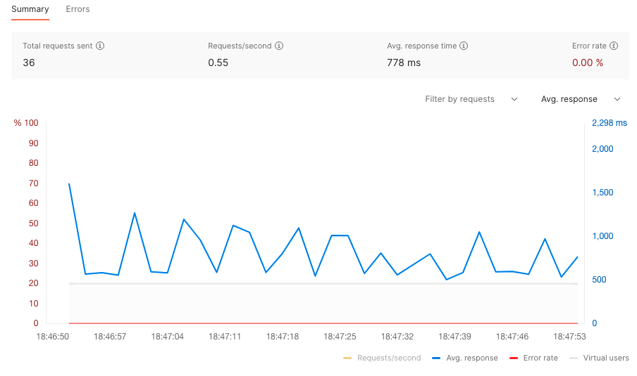
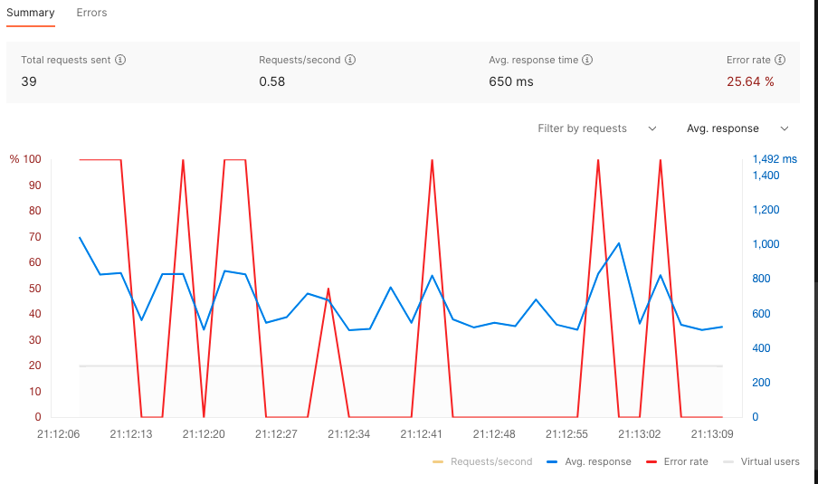
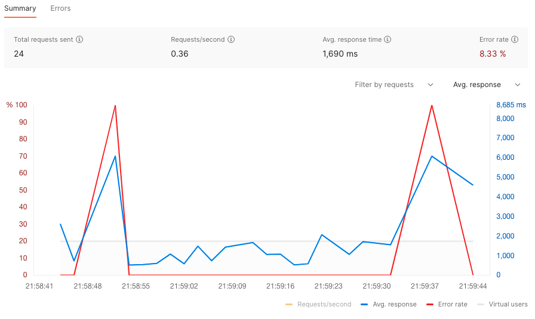

# intro to chaos testing
---

# Prerequisites

1. [Docker](https://docs.docker.com/get-docker/) 
2. [Visual Studio Code](https://code.visualstudio.com/download)
3. [Dev Containers](https://marketplace.visualstudio.com/items?itemName=ms-vscode-remote.remote-containers)
4. [ngrok account](https://dashboard.ngrok.com/)
5. Docker `chaos-testing` network created: `$ docker network create chaos-testing`
6. Cloned `chaos-testing` [repo](git@github.com:RampNetwork/chaos-testing.git)
---

# *hello world* (well, not actually *hello world*, *[but still](https://youtu.be/YeMnPyusuBE?t=274)*)

<!-- 
The joke is from Monty Python's "Funniest Joke in the World". 
Luckily, nobody here speaks German, so we are safe 😆
-->
---

# even the best joke can get boring

<!-- 
We need to spice up our service, as we are loosing our customers at alarming rate.
-->
---
# but there is a problem

<!-- 
avreage response time is ~700mS. But average user gets bored after 750mS, so we're tight.
-->
---
# looks like we're failing

---
# Chaos Engineering

Chaos engineering is the practice of intentionally injecting faults into a system to test its resilience. 
The goal is to identify potential failure points and correct them before they cause an actual outage or other disruption.

---
# [ToxiProxy](https://github.com/Shopify/toxiproxy) comes into play

<!-- 
Developed by Shopify, Toxiproxy is a framework for simulating network conditions. It's made specifically to work in testing, CI and development environments, supporting deterministic tampering with connections, but with support for randomized chaos and customization.
-->

---
# Let's give it a (re)try

<!-- 
We are using axios-retry to fix the situation.
As timeout by default does not trigger retry, we need to make it explicit
  shouldResetTimeout: true,
  retryCondition: (_error) => true
We need to mind if we're not overflooding the system with re-tries, but that's entirely different problem
-->

